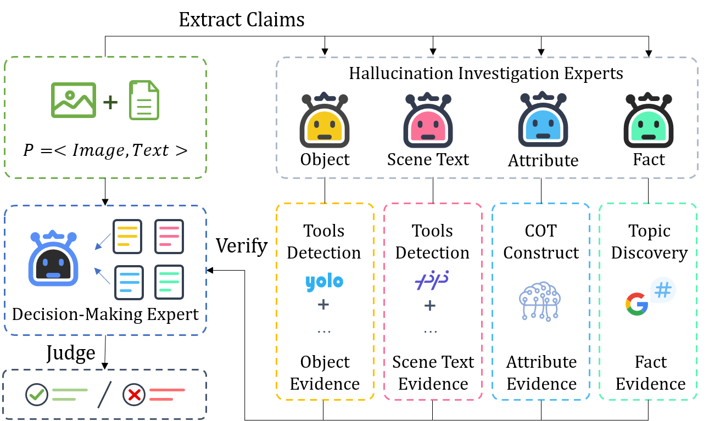

## METER: Multimodal Hallucination Detection with Mixture of Experts via Tools Ensembling and Reasoning


## Overview

METER is a multimodal hallucination detection method guided by the chain of thought, which incorporates domain knowledge to address semantic duality and enhance model inference. You can easily use it for Large Vision-Language Models (LVLMs) in your research experiments. 

### Preliminaries
METER is supposed to detect the hallucinations on in four categories: 
1) **Object Hallucination** refers to a misperceived presence of objects in an image or conflicts between objects depicted in an image and their corresponding textual descriptions. 
2) **Attribute Hallucination** occurs when the LVLM generates incorrect attribute information or inaccurately describes objects' attributes in an image, such as positions, colors, and actions. 
3) **Scene-Text Hallucination** involves incorrect generation or recognition of text found in various real-world contexts, such as books, signs, banners, and product descriptions.
4) **Factuality Hallucination** refers to the generation of images or text that contradict established real-world knowledge, violate common sense, or conflict with factual information.
All hallucinations are suitable for image-to-text and text-to-image generation tasks.


### METER Illustration
The framework of METER is depicted in Figure 1. We appoint mixed experts to collect evidence for hallucination, and the decision-making expert provides the final detection result and explanations.
<div align=center>
    
</div>
<div align=center>
Figure 1: The framework of METER.
</div>


### Dataset
We evaluate our method on the [MHaluBench](https://huggingface.co/datasets/openkg/MHaluBench) dataset.


## Quick Start

**Step1: Installation for tools**

```
# install Yolo world
pip install ultralytics==8.2.2
pip install openai-clip

download weight: https://github.com/ultralytics/assets/releases/download/v8.1.0/yolov8s-world.pt

# install paddleocr
pip install paddleocr==2.7.3
pip install paddlepaddle-gpu==2.6.1

# install GroundingDINO
git clone https://github.com/IDEA-Research/GroundingDINO.git
cp -r GroundingDINO pipeline/GroundingDINO
cd pipeline/GroundingDINO/
pip install -e .
cd ..

download weight: 
https://github.com/IDEA-Research/GroundingDINO/releases/download/v0.1.0-alpha/groundingdino_swint_ogc.pth

# install MAERec
git clone https://github.com/Mountchicken/Union14M.git
cp -r Union14M/mmocr-dev-1.x pipeline/mmocr
cd pipeline/mmocr/
pip install -U openmim
mim install mmengine
mim install mmcv
mim install mmdet
pip install timm
pip install -r requirements/albu.txt
pip install -r requirements.txt
pip install -v -e .
cd ..

download weight: https://download.openmmlab.com/mmocr/textdet/dbnetpp/dbnetpp_resnet50-oclip_fpnc_1200e_icdar2015/dbnetpp_resnet50-oclip_fpnc_1200e_icdar2015_20221101_124139-4ecb39ac.pth

download weight: 
https://github.com/Mountchicken/Union14M/releases/download/Checkpoint/maerec_b_union14m.pth
```

**Step2: Write a configuration file in yaml format**
Users can easily configure the parameters of METER in a yaml file. 
The path of the configuration file is EasyDetect/pipeline/config/config.yaml

```yaml
openai:
  api_key: # your_openai_API_key
  base_url: 
  temperature: 0.2  
  max_tokens: 1024
gemini:
  GOOGLE_API_KEY: # your_gemini_API_key
tool: 
  detect:
    groundingdino_config: # the path of GroundingDINO_SwinT_OGC.py
    model_path: # the path of groundingdino_swint_ogc.pth
    device: cuda:0
    BOX_TRESHOLD: 0.35
    TEXT_TRESHOLD: 0.25
    AREA_THRESHOLD: 0.001
  ocr:
    dbnetpp_config: # the path of dbnetpp_resnet50-oclip_fpnc_1200e_icdar2015.py
    dbnetpp_path: # the path of maerec_b_union14m.py
    maerec_path: # the path of maerec_b.pth
    device: cuda:0
    content: word.number
    cachefiles_path: # the path of cache_files to save temp images
    BOX_TRESHOLD: 0.2
    TEXT_TRESHOLD: 0.25
  google_serper:
    serper_api_key: # your_google_serper_API_key
    snippet_cnt: 10
prompts:
  claim_generate: pipeline/prompts/claim_generate.yaml
  query_generate: pipeline/prompts/query_generate.yaml
  verify: pipeline/prompts/verify.yaml
```

**Step3: Run with the code**
```python
python METER.py
```

## Citation
Please cite our repository if you use METER in your work.
```bibtex

```
